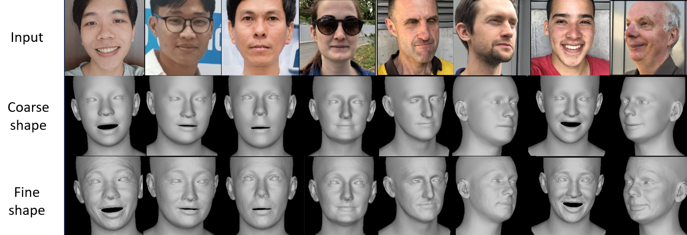

# 3DFace_DaViT_Blender
3D face reconstruction from single image using Dual Vision Transformer network and plugin for Blender

 

Our texture reconstruction result. From left to right of each view: direct projected texture, fine texture, coarse 3DMM texture.

 

Our shape reconstruction results.

Demo Video: https://www.youtube.com/watch?v=qp1f-0poktE

**In processing, please wait**

## Introduction

This source code enables the recreation of a three-dimensional human face model from a two-dimensional input image. The model employs the 3DMM Flame and the deep learning network DaViT. Moreover, the source code includes a plugin within the Blender software, enhancing its usability for users.

## Getting Started

please read [INSTALL.md](ReadMe/INSTALL.md) for more details.

## Evaluation

## Training

please read [TRAINING.md](ReadMe/TRAINING.md) for more details.

## Citation 

Please cite our github repo if you find our work helpful.

